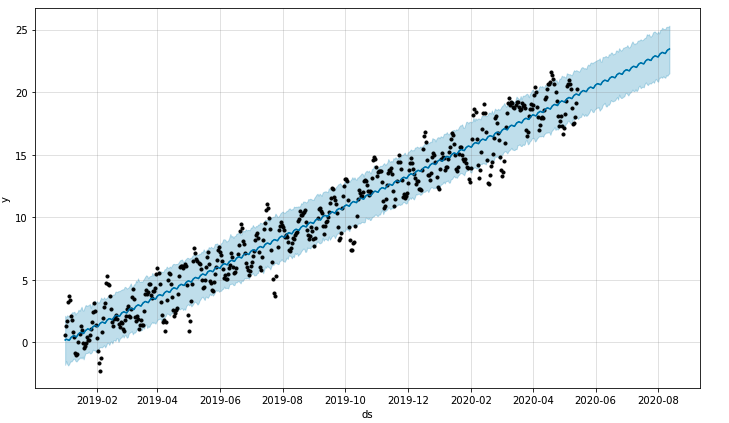

# Traffic Predictions
## Highway MercadoLibre

This notebook will predict search traffic and see if that will translate into the ability to successfully trade the stock. In this notebook we will prepare the data, analyze the data, and visualize the data for the time series data that we will need to understand. We will visualize depictions of seasonality that are of interest to the company, evaluate how the company's stock price correlates to it's Google search traffic, and forecast models that can predict hourly user search traffic.



---

## Technologies

This project uses a Jupyter Notebook in Jupyter Lab or Google Collab with the following libraries:

- Pandas: to help with the robust amount of features that will help analyze and organize the data.
- HvPlot: to create interactive data visualizations and charts that are visually pleasing to the audience
- Holoviews: to create interactive data visualizition and charts if Google Collab is used. 
- Facebook Prophet: to analyze time series data, automate time series forecasting, and streamline analysis.
- Datetime: to do mathematical and other programming operations on dates and times.


---

## Usage

To succesfully run this notebook, please be sure to import the required libraries and dependencies:

```
from path import Path
import pandas as pd
import holoviews as hv
from fbprophet import Prophet
import hvplot.pandas
import datetime as dt
%matplotlib inline
```

---

## Contributors

Michael Husary was the main contributer along with fellow classmates and the educational staff. 

--- 

## License
*(Not sure if a license was required on this Challenge)*


MIT
